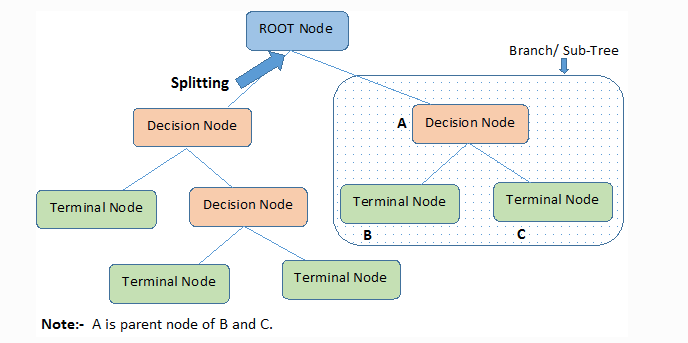

## Practical 03

## Problem Statement

**Decision Tree Learning**

1. Implement the Decision Tree Learning algorithm to build a decision tree for a given dataset.
2. Evaluate the accuracy and effectiveness of the decision tree on test data.
3. Visualize and interpret the generated decision tree.

---

Decision Tree algorithm belongs to the family of supervised learning algorithms. Unlike other supervised learning algorithms, the decision tree algorithm can be used for solving **regression and classification problems** too.

The goal of using a Decision Tree is to create a training model that can use to predict the class or value of the target variable by **learning simple decision rules** inferred from prior data(training data).

### Types of Decision Trees

Types of decision trees are based on the type of target variable we have. It can be of two types:

1. **Categorical Variable Decision Tree:** Decision Tree which has a categorical target variable then it called a **Categorical variable decision tree.**
2. **Continuous Variable Decision Tree:** Decision Tree has a continuous target variable then it is called **Continuous Variable Decision Tree.**

## **Terminology related to Decision Trees**

1. **Root Node:** It represents the entire population or sample and this further gets divided into two or more homogeneous sets.
2. **Splitting:** It is a process of dividing a node into two or more sub-nodes.
3. **Decision Node:** When a sub-node splits into further sub-nodes, then it is called the decision node.
4. **Leaf / Terminal Node:** Nodes do not split is called Leaf or Terminal node.
5. **Pruning:** When we remove sub-nodes of a decision node, this process is called pruning. You can say the opposite process of splitting.
6. **Branch / Sub-Tree:** A subsection of the entire tree is called branch or sub-tree.
7. **Parent and Child Node:** A node, which is divided into sub-nodes is called a parent node of sub-nodes whereas sub-nodes are the child of a parent node.
    
    

    

## Algorithm

The decision of making strategic splits heavily affects a tree’s accuracy. The decision criteria are different for classification and regression trees.

The ID3 algorithm builds decision trees using a top-down [greedy search](https://www.hackerearth.com/practice/algorithms/greedy/basics-of-greedy-algorithms/tutorial/) approach through the space of possible branches with no backtracking. A greedy algorithm, as the name suggests, always makes the choice that seems to be the best at that moment.

Steps in ID3 algorithm.

1. It begins with the original set S as the root node.
2. On each iteration of the algorithm, it iterates through the very unused attribute of the set S and calculates **Entropy(H)** and **Information gain(IG)** of this attribute.
3. It then selects the attribute which has the smallest Entropy or Largest Information gain.
4. The set S is then split by the selected attribute to produce a subset of the data.
5. The algorithm continues to recur on each subset, considering only attributes never selected before.


## Time and Space Complexity

1. The train time complexity for the ID3 algorithms would be 
    
    ```
    O (n * logn * d)
    ```
    
    where,
    
    $n$ is the number of data points
    
    $d$ is the number of dimensions
    
2. The train space time complexity would be $O(nodes)$.
3. The test time complexity would be $O(depth)$.
4. The test space complexity would be $O(nodes)$.

---